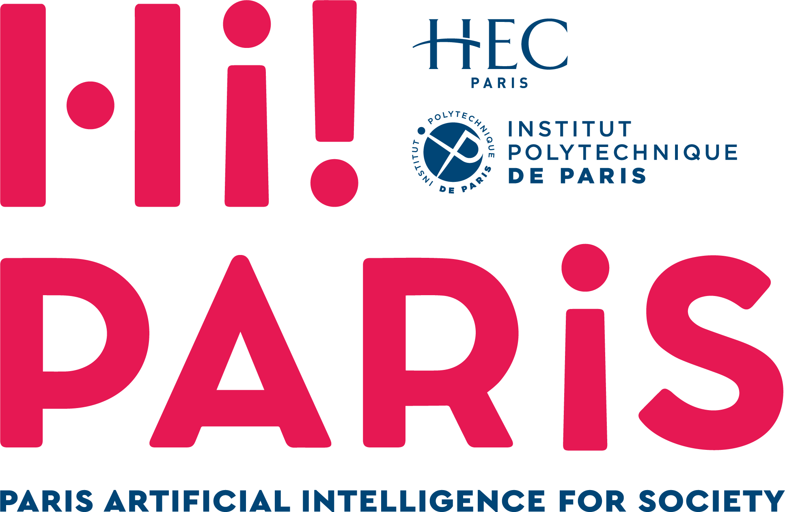
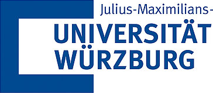

This workshop will discuss core challenges and new solutions in perception and learning (P&L) for autonomous robots operating over long terms in the wild, complex and unstructured environments.
With robotics applications in the wild broadening from environmental monitoring and agriculture to autonomous driving and disaster relief, the requirement for **long-term robust, adaptive, and intelligent** systems becomes essential.
This workshop will bring together researchers and practitioners to share new technologies in sensor processing, scene understanding, mapping, localization, and machine learning to address the unique demands of long-term operations in the wild, including varying terrain, adverse weather, dynamic lighting conditions, and seasonal changes.
Our goal is to foster collaboration and move toward new frontiers in robust multimodal perception, self-supervised learning, online / continual / lifelong learning, simulation-to-reality transfer, and explainable AI to enable safe, reliable and long-term autonomous robots in the wild.
This workshop will feature presentations, papers, and interactive discussion by leading experts, highlighting recent developments and future research directions for enhanced long-term performance of robotic systems in the wild.

## Venue

Somewhere in Vienna.

## Call for papers

The workshop will cover a range of topics, including but not limited to:
* Long-term autonomy, persistent mapping, and online/continual/lifelong learning to handle novelty and concept drift in ever-changing environments.
* Robust perception (e.g., segmentation, detection, VSLAM) under adverse and dynamic conditions in the wild (e.g., rain, fog, day/night transitions, seasonal changes).
* Sensor fusion (e.g., lidar-camera, radar-camera, IMU) for robust, long-term state estimation and comprehensive scene understanding.
* Self-supervised, unsupervised, and weakly-supervised learning from large-scale, unlabeled data gathered during long-term deployments.
* Machine learning for terrain classification and traversability analysis on evolving or partially-observed terrains in the wild.
* Sim-to-real transfer and domain adaptation for robust performance across diverse and changing conditions in the wild.
* Foundation models and their application to perception and learning for robotics in the wild.
* Safety, long-term reliability, uncertainty quantification, and explainability of P\&L systems operating in the wild.
* Novel sensors, long-term or multi-season datasets, and benchmarks for evaluating perception and learning in the wild.
* Reinforcement learning for navigation and interaction in dynamic, unpredictable scenes.
* Data generation, augmentation, and active learning for challenging and imbalanced data from the wild.
* Applications (e.g., autonomous driving, agriculture, logistics, environmental monitoring) with a clear focus on their long-term perception and learning challenges.

## Submission guidelines

* A
* B
* C
* D
* E

## Important dates

* Paper submission deadline: March 31, 2026, 11:59 p.m. (Anywhere on Earth)
* Paper notification of acceptance:  April 30, 2026
* Workshop date: May ??, 2026

The best submissions will be invited to submit a full-length paper in a Special Issue of the [Autonomous Robots](https://link.springer.com/journal/10514).

## Schedule

| **Time** | **Speaker** | **Topic / Title** |
| -------- | ----------- | ----------------- |
| 08:50 - 09:00 | Organizers   | Welcome and Workshop Overview                |
| 09:00 - 09:30 | Speaker 1    | Invited Talk #1 + Q&A                        |
| 09:30 - 10:00 | Speaker 2    | Invited Talk #2 + Q&A                        |
| 10:00 - 10:20 | 5 papers     | Lightning Talks (3 min/pers)                 |
| 10:20 - 11:00 | -            | Coffee Break & Poster Session Setup          |
| 11:00 - 11:30 | Speaker 3    | Invited Talk #3 + Q&A                        |
| 11:30 - 12:00 | Speaker 4    | Invited Talk #4 + Q&A                        |
| 12:00 - 14:00 | -            | Lunch Break & Continued Poster Session       |
| 14:00 - 14:30 | Speaker 5    | Invited Talk #5 + Q&A                        |
| 14:30 - 15:00 | Speaker 6    | Invited Talk #6 + Q&A                        |
| 15:00 - 15:20 | 5 papers     | Lightning Talks (3 min/pers)                 |
| 15:20 - 16:00 | -            | Coffee Break & Continued Poster Session      |
| 16:00 - 16:30 | Speaker 7    | Invited Talk #7 + Q&A                        |
| 16:30 - 17:00 | All speakers | Interactive Panel Discussion                 |
| 17:00 - 17:30 | Organizers   | Best Presentation Awards and Closing Remarks |

## Speakers

* A
* B
* C
* D
* E
* F
* G

## Organizers

\
[Zhi Yan](https://yzrobot.github.io/)\
ENSTA - Institut Polytechnique de Paris

\
[François Goulette](https://www.ensta-paris.fr/fr/francois-goulette)\
ENSTA - Institut Polytechnique de Paris

\
[Alexandre Chapoutot](https://www.ensta-paris.fr/fr/alexandre-chapoutot)\
ENSTA - Institut Polytechnique de Paris

\
[David Filliat](https://perso.ensta-paris.fr/~filliat/en/)\
AMIAD - Agence Ministérielle pour l'IA de Défense

\
[Andreas Nüchter](https://www.informatik.uni-wuerzburg.de/robotics/team/nuechter/)\
University of Würzburg

\
[Tao Yang](https://teacher.nwpu.edu.cn/yangtao2020.html)\
Northwestern Polytechnical University

\
[Tomas Krajnik](https://chronorobotics.fel.cvut.cz/)\
Czech Technical University in Prague

## Contact

If you have any questions, please contact us at [lowi@gmail.com](mailto:lowi@gmail.com).

---

&nbsp;&nbsp;
&nbsp;&nbsp;
&nbsp;&nbsp;
&nbsp;&nbsp;
&nbsp;&nbsp;
&nbsp;&nbsp;

