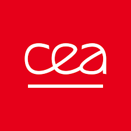

This workshop will discuss core challenges and new solutions in perception and learning (P&L) for autonomous robots operating over long terms in the wild, complex and unstructured environments.
With robotics applications in the wild broadening from environmental monitoring and agriculture to autonomous driving and disaster relief, the requirement for **long-term robust, adaptive, and intelligent** systems becomes essential.
This workshop will bring together researchers and practitioners to share new technologies in sensor processing, scene understanding, mapping, localization, and machine learning to address the unique demands of long-term operations in the wild, including varying terrain, adverse weather, dynamic lighting conditions, and seasonal changes.
Our goal is to foster collaboration and move toward new frontiers in robust multimodal perception, self-supervised learning, online / continual / lifelong learning, simulation-to-reality transfer, and explainable AI to enable safe, reliable and long-term autonomous robots in the wild.
This workshop will feature presentations, papers, and interactive discussion by leading experts, highlighting recent developments and future research directions for enhanced long-term performance of robotic systems in the wild.

## Venue

VIECON (formerly Messe Wien), Vienna, Austria.

## Call for papers

The workshop will cover a range of topics, including but not limited to:
* Long-term autonomy, persistent mapping, and online/continual/lifelong learning in ever-changing environments.
* Robust perception in harsh and dynamic conditions in the wild.
* Sensor fusion for robust long-term state estimation and scene understanding.
* Self-supervised/unsupervised/weakly-supervised learning in LoWi.
* Terrain classification and traversability analysis in LoWi.
* Sim-to-real transfer and domain adaptation in LoWi.
* Foundational models and their applications in LoWi.
* Safety, long-term reliability, uncertainty quantification, and interpretability in LoWi.
* Novel sensors, long-term or multi-season datasets, and benchmarks in LoWi.
* Reinforcement learning for navigation and interaction in dynamic, unpredictable scenarios.
* Data generation, augmentation, and active learning for the wild.
* Applications with an clear focus on long-term perception, learning, and navigation challenges.

## Submission guidelines

* We invite submissions of full papers of 4 to 8 pages, including references, formatted using the standard [IEEE RAS conference template](https://ras.papercept.net/conferences/support/tex.php).
* Submissions must present new, high-quality research on the workshop's themes.
* Submitted papers must not be under review or have been published in another archival venue.
* A double-blind peer-review process will be implemented. Papers will be evaluated based on their novelty, technical soundness, clarity, and relevance to the workshop.
* A selected number of high-quality papers will be invited to submit an extended version of their work to a special issue in a major journal.
* All accepted papers will be invited for either a spotlight oral or a poster presentation at the workshop.
* Thanks to our sponsor, a $300 Best Presentation Award, along with a certificate, will be given to a standout presentation at the workshop. <!-- The award will be titled "ICRA 2026 Workshop on Long-Term Autonomy in the Wild: Best Presentation Award." -->
* Details on the submission portal will be announced on the workshop website.

## Important dates

* Paper submission deadline: March 31, 2026, 11:59 p.m. (Anywhere on Earth)
* Paper notification of acceptance:  April 30, 2026
* Workshop date: May ??, 2026

The best submissions will be invited to submit a full-length paper in a Special Issue of the [IEEE Transactions on Field Robotics](https://www.ieee-ras.org/publications/t-fr).

## Schedule

| **Time** | **Speaker** | **Topic / Title** |
| -------- | ----------- | ----------------- |
| 08:50 - 09:00 | Organizers   | Welcome and Workshop Overview                |
| 09:00 - 09:30 | Speaker 1    | Invited Talk #1 + Q&A                        |
| 09:30 - 10:00 | Speaker 2    | Invited Talk #2 + Q&A                        |
| 10:00 - 10:20 | 5 papers     | Lightning Talks (3 min/pers)                 |
| 10:20 - 11:00 | -            | Coffee Break & Poster Session Setup          |
| 11:00 - 11:30 | Speaker 3    | Invited Talk #3 + Q&A                        |
| 11:30 - 12:00 | Speaker 4    | Invited Talk #4 + Q&A                        |
| 12:00 - 14:00 | -            | Lunch Break & Continued Poster Session       |
| 14:00 - 14:30 | Speaker 5    | Invited Talk #5 + Q&A                        |
| 14:30 - 15:00 | Speaker 6    | Invited Talk #6 + Q&A                        |
| 15:00 - 15:20 | 5 papers     | Lightning Talks (3 min/pers)                 |
| 15:20 - 16:00 | -            | Coffee Break & Continued Poster Session      |
| 16:00 - 16:30 | Speaker 7    | Invited Talk #7 + Q&A                        |
| 16:30 - 17:00 | All speakers | Interactive Panel Discussion                 |
| 17:00 - 17:30 | Organizers   | Best Presentation Awards and Closing Remarks |

## Speakers

**Title: TBD**\
\
[Teresa Vidal Calleja](https://profiles.uts.edu.au/Teresa.VidalCalleja)\
University of Technology Sydney, Australia

**Title: TBD**\
\
[Kazunori Ohno](https://www.r-info.tohoku.ac.jp/en/1dbca76142c072cb4a4403b1c317eb26.html)\
Tohoku University, Japan

**Title: TBD**\
\
[Xieyuanli Chen](https://chen-xieyuanli.github.io/)\
National University of Defense Technology, China

**Title: TBD**\
\
[Jaime Pulido Fentanes](https://scholar.google.es/citations?user=rTntw-wAAAAJ)\
Saga Robotics, Norway

**Title: TBD**\
\
[Timothy D Barfoot](http://asrl.utias.utoronto.ca/~tdb/)\
University of Toronto, Canada

**Title: TBD**\
\
[Marija Popović](https://research.tudelft.nl/en/persons/m-popovic)\
Delft University of Technology, Netherlands

* G

## Organizers

\
[Zhi Yan](https://yzrobot.github.io/)\
ENSTA - Institut Polytechnique de Paris, France

\
[François Goulette](https://www.ensta-paris.fr/fr/francois-goulette)\
ENSTA - Institut Polytechnique de Paris, France

\
[Alexandre Chapoutot](https://www.ensta-paris.fr/fr/alexandre-chapoutot)\
ENSTA - Institut Polytechnique de Paris, France

\
[David Filliat](https://perso.ensta-paris.fr/~filliat/en/)\
AMIAD, France

\
[Andreas Nüchter](https://www.informatik.uni-wuerzburg.de/robotics/team/nuechter/)\
University of Würzburg, Germany

\
[Tao Yang](https://teacher.nwpu.edu.cn/yangtao2020.html)\
Northwestern Polytechnical University, China

\
[Martyna Poreba](https://fr.linkedin.com/in/martynaporeba)\
Université Paris-Saclay, CEA, List, France

\
[Fatemeh Rekabi Bana](https://www.durham.ac.uk/staff/fatemeh-rekabi-bana/)\
Durham University, UK

\
[Jindriska Deckerova](https://deckejin.github.io/)\
Czech Technical University in Prague, Czech Republic

\
[Tomas Krajnik](https://chronorobotics.fel.cvut.cz/)\
Czech Technical University in Prague, Czech Republic

## Sponsors

## Contact

If you have any questions, please contact us at [lowi@gmail.com](mailto:lowi@gmail.com).

---

&nbsp;&nbsp;
&nbsp;&nbsp;
&nbsp;&nbsp;
&nbsp;&nbsp;
&nbsp;&nbsp;
&nbsp;&nbsp;
&nbsp;&nbsp;

